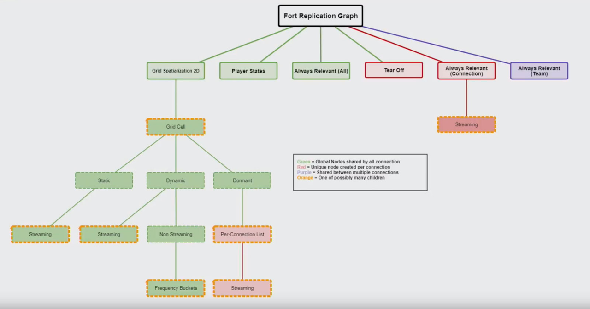
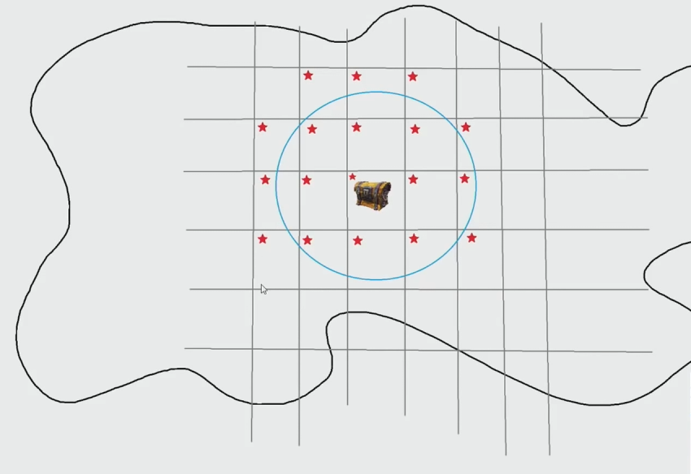
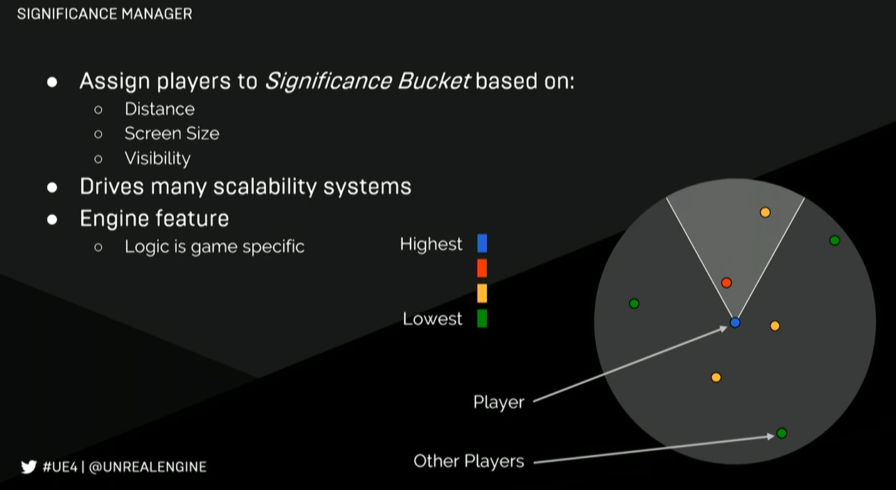

# DS优化思路
___
## 1 网络同步

### 1.1 Condition Property Replication
属性同步的条件，在每个Actor的`GetLifetimeReplicatedProps`函数中都需要指定每个可同步的成员变量的同步条件。尽可能地缩小属性同步的范围，从而节省同步的流量。
```C++
void AActor::GetLifetimeReplicatedProps( TArray< FLifetimeProperty > & OutLifetimeProps ) const
{
    DOREPLIFETIME_CONDITION(AActor, ReplicatedMovement, COND_SimulatedOnly);
}
```
所有的属性同步条件类型：
```C++
/** Secondary condition to check before considering the replication of a lifetime property. */
UENUM(BlueprintType)
enum ELifetimeCondition : int
{
    COND_None = 0                    // This property has no condition, and will send anytime it changes
    COND_InitialOnly = 1             // This property will only attempt to send on the initial bunch
    COND_OwnerOnly = 2               // This property will only send to the actor's owner
    COND_SkipOwner = 3               // This property send to every connection EXCEPT the owner
    COND_SimulatedOnly = 4           // This property will only send to simulated actors
    COND_AutonomousOnly = 5          // This property will only send to autonomous actors
    COND_SimulatedOrPhysics = 6      // This property will send to simulated OR bRepPhysics actors
    COND_InitialOrOwner = 7          // This property will send on the initial packet, or to the actors owner
    COND_Custom = 8                  // This property has no particular condition, but wants the ability to toggle on/off via SetCustomIsActiveOverride
    COND_ReplayOrOwner = 9           // This property will only send to the replay connection, or to the actors owner
    COND_ReplayOnly = 10             // This property will only send to the replay connection
    COND_SimulatedOnlyNoReplay = 11  // This property will send to actors only, but not to replay connections
    COND_SimulatedOrPhysicsNoReplay = 12   // This property will send to simulated Or bRepPhysics actors, but not to replay connections
    COND_SkipReplay = 13             // This property will not send to the replay connection
    COND_Dynamic = 14                // This property wants to override the condition at runtime. Defaults to always replicate until you override it to a new condition.
    COND_Never = 15                  // This property will never be replicated
    COND_NetGroup = 16               // This subobject will replicate to connections that are part of the same group the subobject is registered to. Not usable on properties.
    COND_Max = 17                    
};
```

### 1.2 Dormancy
> [Optimizing Server Performance with Net Dormancy](https://dev.epicgames.com/community/learning/tutorials/K8vY/unreal-engine-optimizing-server-performance-with-net-dormancy) 

Actor休眠，适合低频率同步的Actor。将一个同步频率较低的Actor标记为休眠，则NetDriver的同步Actor列表将跳过该Actor，Actor的属性不再自动同步，从而减少同步属性的比较时间。休眠不会导致Actor被从客户端中删除，Actor在客户端中仍然可见。只有Actor重新被标记为Awake，其属性才能自动同步。
```C++
/** Describes if an actor can enter a low network bandwidth dormant mode */
UENUM(BlueprintType)
enum ENetDormancy : int
{
    /** This actor can never go network dormant. */
    DORM_Never UMETA(DisplayName = "Never"),
    /** This actor can go dormant, but is not currently dormant. Game code will tell it when it go dormant. */
    DORM_Awake UMETA(DisplayName = "Awake"),
    /** This actor wants to go fully dormant for all connections. */
    DORM_DormantAll UMETA(DisplayName = "Dormant All"),
    /** This actor may want to go dormant for some connections, GetNetDormancy() will be called to find out which. */
    DORM_DormantPartial UMETA(DisplayName = "Dormant Partial"),
    /** This actor is initially dormant for all connection if it was placed in map. */
    DORM_Initial UMETA(DisplayName = "Initial"),

    DORM_MAX UMETA(Hidden),
};
```
将Actor标记为休眠的两种方法：
- 在构造函数中指定`NetDormancy`的初始值
- 调用`AActor::SetNetDormancy`来更改休眠状态
```C++
/** Puts actor in dormant networking state */
UFUNCTION(BlueprintAuthorityOnly, BlueprintCallable, Category = "Networking")
ENGINE_API void SetNetDormancy(ENetDormancy NewDormancy);
```
当Actor已经处于休眠状态，但又需要Actor进行一次属性同步时可以调用AActor::FlushNetDormancy，该方法可以强制Actor进行一次属性同步且不会改变Actor的休眠状态。AActor::ForceNetUpdate也可以起到同样的作用，保证Actor在下一次网络同步中同步属性。两个方法的区别是AActor::FlushNetDormancy需要在属性改变之前调用，否则改变不会被同步；AActor::ForceNetUpdate在属性改变之前或之后调用均可以实现单次的属性同步。
```C++
/** Forces dormant actor to replicate but doesn't change NetDormancy state (i.e., they will go dormant again if left dormant) */
UFUNCTION(BlueprintAuthorityOnly, BlueprintCallable, Category="Networking")
ENGINE_API void FlushNetDormancy();

/** Force actor to be updated to clients/demo net drivers */
UFUNCTION( BlueprintCallable, Category="Networking")
ENGINE_API virtual void ForceNetUpdate();
```

### 1.3 Relevancy
设置Actor的相关性，可以控制Actor能否被同步。
- Actor::NetUpdateFrequency：控制Actor同步的频率。
```C++
/** How often (per second) this actor will be considered for replication, used to determine NetUpdateTime */
UPROPERTY(Category=Replication, EditDefaultsOnly, BlueprintReadWrite)
float NetUpdateFrequency;
```
- Actor::GetNetPriority：控制Actor同步的优先级。
```C++
/**
 * Function used to prioritize actors when deciding which to replicate
 * @param ViewPos      Position of the viewer
 * @param ViewDir      Vector direction of viewer
 * @param Viewer       "net object" owned by the client for whom net priority is being determined (typically player controller)
 * @param ViewTarget    The actor that is currently being viewed/controlled by Viewer, usually a pawn
 * @param InChannel    Channel on which this actor is being replicated.
 * @param Time        Time since actor was last replicated
 * @param bLowBandwidth True if low bandwidth of viewer
 * @return           Priority of this actor for replication, higher is more important
 */
ENGINE_API virtual float GetNetPriority(const FVector& ViewPos, const FVector& ViewDir, class AActor* Viewer, AActor* ViewTarget, UActorChannel* InChannel, float Time, bool bLowBandwidth);
```
- Actor::NetCullDistanceSquared：控制Actor同步的最大距离。超越该距离的Actor将不会同步，且会被从客户端中删除，客户端中不可见。
```C++
/** Square of the max distance from the client's viewpoint that this actor is relevant and will be replicated. */
UPROPERTY(BlueprintReadOnly, EditDefaultsOnly, Category=Replication)
float NetCullDistanceSquared;
```
- Actor::bAlwaysRelevant：控制Actor是否同步到所有客户端。bAlwaysRelevant的设置将覆盖bOnlyRelevantToOwner。
```C++
/** Always relevant for network (overrides bOnlyRelevantToOwner). */
UPROPERTY(Category=Replication, EditDefaultsOnly, BlueprintReadWrite)
uint8 bAlwaysRelevant:1;
```
- Actor::bOnlyRelevantToOwner：控制Actor是否只同步到拥有者的客户端。
```C++
/** If true, this actor is only relevant to its owner. If this flag is changed during play, all non-owner channels would need to be explicitly closed. */
UPROPERTY(Category=Replication, EditDefaultsOnly, BlueprintReadOnly)
uint8 bOnlyRelevantToOwner:1;
```
- Actor::IsRelevancyOwnerFor：当Actor只同步到拥有者的客户端时，判断当前客户端是否为Actor的拥有者的方法。
```C++
/**
 * Check if this actor is the owner when doing relevancy checks for actors marked bOnlyRelevantToOwner
 *
 * @param ReplicatedActor - the actor we're doing a relevancy test on
 * @param ActorOwner - the owner of ReplicatedActor
 * @param ConnectionActor - the controller of the connection that we're doing relevancy checks for
 *
 * @return bool - true if this actor should be considered the owner
 */
ENGINE_API virtual bool IsRelevancyOwnerFor(const AActor* ReplicatedActor, const AActor* ActorOwner, const AActor* ConnectionActor) const;
```
- Actor::IsNetRelevantFor：判断Actor是否具有相关性。
```C++
/** 
 * Checks to see if this actor is relevant for a specific network connection
 *
 * @param RealViewer - is the "controlling net object" associated with the client for which network relevancy is being checked (typically player controller)
 * @param ViewTarget - is the Actor being used as the point of view for the RealViewer
 * @param SrcLocation - is the viewing location
 *
 * @return bool - true if this actor is network relevant to the client associated with RealViewer 
 */
ENGINE_API virtual bool IsNetRelevantFor(const AActor* RealViewer, const AActor* ViewTarget, const FVector& SrcLocation) const;
```

### 1.4 Push Model
普通属性同步潜在问题：
- 同步时需要遍历所有属性并进行逐个比较，浪费CPU且缓存命中情况较差。通常一帧内只会修改Actor中其中一条数据，大部分的比较是无意义的。
- 在需要同步的属性数据量较多时，无意义的数据比较产生的开销大。
- 默认情况下，Actor的bReplicates设置为true后，属性变化后所有数据均进行同步，可能同步了很多没有变化的数据，浪费了流量。

Push Model特点：
- 仅比较已置脏的数据，减少属性无意义比较产生的开销，精确控制每一个属性。
- 比较时可以直接进行位操作，用Bit的方式比较，将属性映射成一个BitArray。在属性的Setter中将对应的Bit位标志为Dirty。
- 会增加额外的内存消耗。

使用方法：
1. 在AActor::GetLifetimeReplicatedProps中声明Actor的哪个属性需要同步且使用PushModel。
```C++
FDoRepLifetimeParams SharedParams;
SharedParams.bIsPushBased = true; //设置为采用PushModel
DOREPLIFETIME_WITH_PARAMS_FAST(AActor, Score, SharedParams);
```
2. 在属性变化后将该属性置脏。
```C++
Score = 100;
MARK_PROPERTY_DIRTY_FROM_NAME(AActor, Score, this); //置脏
```
MARK_PROPERTY_DIRTY_FROM_NAME是属性置脏操作的宏之一。所有属性置脏操作的宏：
```C++
// Marks a property dirty by UProperty*, validating that it's actually a replicated property.
#define MARK_PROPERTY_DIRTY(Object, Property)

// Marks a property dirty, given the Class Name, Property Name, and Object. This will fail to compile if the Property or Class aren't valid.
// 编译时增加一层对类名和属性名合法性的检查
#define MARK_PROPERTY_DIRTY_FROM_NAME(ClassName, PropertyName, Object)

// Marks a static array property dirty given, the Object, UProperty*, and Index.
#define MARK_PROPERTY_DIRTY_STATIC_ARRAY_INDEX(Object, Property, ArrayIndex)

// Marks a static array property dirty, given the Class Name, Property Name, Index, and Object. This will fail to compile if the Property and Class aren't valid. Callers are responsible for validating the index.
// Array中只有单个元素修改，根据索引只将该元素置脏 编译时增加一层对类名和属性名合法性的检查
#define MARK_PROPERTY_DIRTY_FROM_NAME_STATIC_ARRAY_INDEX(ClassName, PropertyName, ArrayIndex, Object)

// Marks all elements of a static array property dirty, given the Object and UProperty*
#define MARK_PROPERTY_DIRTY_STATIC_ARRAY(Object, Property)

// Marks an entire static array property dirty, given the Class Name, Property Name, and Object. This will fail to compile if the Property or Class aren't valid.
// 将整个Array置脏 编译时增加一层对类名和属性名合法性的检查
#define MARK_PROPERTY_DIRTY_FROM_NAME_STATIC_ARRAY(ClassName, PropertyName, Object)
```

### 1.5 Fast Array
FastArray适用于由UStruct组成、数据量大且修改不频繁的数组，它能够减少数组同步产生的带宽。由于FastArray还需要同步对数组进行操作的信息，因此当数组的修改过于频繁时，FastArray的优势不复存在。
- FastArray的优点：FastArray根据ReplicationID进行元素比较。如果添加或删除了一个元素，可以只同步该元素，不会影响整个数组，避免不必要的数据比对。例如从数组中间删除元素时，该元素后的数组部分整体都会移动，普通的TArray通过元素的位置进行数据比对，因此这部分移动的数组元素将全部进行同步，而FastArray则只同步被删的元素的信息，大大减少了同步的数据量。
- FastArray的缺点：除了同步数组元素以外，也要同步增删改的信息。数组顺序不可被同步，客户端和服务器的数组顺序可能不一致。FastArray不支持嵌套FastArray，如果嵌套会被当作普通的结构体进行同步。修改数组的元素需要手动置脏。

使用方法：详见FastArraySerializer.h。
```C++
/** Step 1: Make your struct inherit from FFastArraySerializerItem */
USTRUCT()
struct FExampleItemEntry : public FFastArraySerializerItem
{
    GENERATED_USTRUCT_BODY()

    // Your data:
    UPROPERTY()
    int32     ExampleIntProperty;    

    UPROPERTY()
    float     ExampleFloatProperty;


    /** 
     * Optional functions you can implement for client side notification of changes to items; 
     * Parameter type can match the type passed as the 2nd template parameter in associated call to FastArrayDeltaSerialize
     * 
     * NOTE: It is not safe to modify the contents of the array serializer within these functions, nor to rely on the contents of the array 
     * being entirely up-to-date as these functions are called on items individually as they are updated, and so may be called in the middle of a mass update.
     */
    void PreReplicatedRemove(const struct FExampleArray& InArraySerializer);
    void PostReplicatedAdd(const struct FExampleArray& InArraySerializer);
    void PostReplicatedChange(const struct FExampleArray& InArraySerializer);

    // Optional: debug string used with LogNetFastTArray logging
    FString GetDebugString();

};

/** Step 2: You MUST wrap your TArray in another struct that inherits from FFastArraySerializer */
USTRUCT()
struct FExampleArray: public FFastArraySerializer
{
    GENERATED_USTRUCT_BODY()

    UPROPERTY()
    TArray<FExampleItemEntry>  Items; /** Step 3: You MUST have a TArray named Items of the struct you made in step 1. */

    /** Step 4: Copy this, replace example with your names */
    bool NetDeltaSerialize(FNetDeltaSerializeInfo & DeltaParms)
    {
       return FFastArraySerializer::FastArrayDeltaSerialize<FExampleItemEntry, FExampleArray>( Items, DeltaParms, *this );
    }
};

/** Step 5: Copy and paste this struct trait, replacing FExampleArray with your Step 2 struct. */
template<>
struct TStructOpsTypeTraits< FExampleArray > : public TStructOpsTypeTraitsBase2< FExampleArray >
{
       enum 
       {
          WithNetDeltaSerializer = true,
       };
};

#endif

/** Step 6 and beyond: 
 *     -Declare a UPROPERTY of your FExampleArray (step 2) type.
 *     -You MUST call MarkItemDirty on the FExampleArray when you change an item in the array. You pass in a reference to the item you dirtied. 
 *        See FFastArraySerializer::MarkItemDirty.
 *     -You MUST call MarkArrayDirty on the FExampleArray if you remove something from the array.
 *     -In your classes GetLifetimeReplicatedProps, use DOREPLIFETIME(YourClass, YourArrayStructPropertyName);
 *
 *     You can provide the following functions in your structure (step 1) to get notifies before add/deletes/removes:
 *        -void PreReplicatedRemove(const FFastArraySerializer& Serializer)
 *        -void PostReplicatedAdd(const FFastArraySerializer& Serializer)
 *        -void PostReplicatedChange(const FFastArraySerializer& Serializer)
 *        -void PostReplicatedReceive(const FFastArraySerializer::FPostReplicatedReceiveParameters& Parameters)
 *
 *     Thats it!
 */ 
```

### 1.6 Replication Graph
> [Replication Graph In Unreal Engine | Unreal Engine 5.4 Documentation](https://dev.epicgames.com/documentation/en-us/unreal-engine/replication-graph-in-unreal-engine?application_version=5.4)
> 
> [Networking in 4.20: The Replication Graph | Feature Highlight | Unreal Engine Livestream](https://www.youtube.com/watch?v=CDnNAAzgltw) 

Replication Graph在场景中存在大量需要同步的Actor以及玩家的情况下，可以针对不同Actor定制不同的自定义同步策略。Replication Graph和UE默认的同步机制是互斥的，二者之间只能使用其中一个。
在通常情况下，我们可能会关闭大量Actor的网络连接以及降低同步的频率来减轻网络同步的压力和处理器的负担，与此同时带来的负面作用是客户端的表现和体验变得卡顿迟缓，也就是说，并不是所有Actor都适用同一种策略，总体的策略无法满足大型游戏的需求。针对不同的Actor我们应该量身定制不同的同步方案，对于那些影响体验、更需要及时响应、影响范围广泛的Actor，我们可以给它设置更高的网络同步频率，扩大它的同步范围，对于影响较小的Actor我们可以适度优化，从而能够减轻一部分的网络同步压力，同时也能给大型多人游戏带来更好的游戏体验。
Replication Graph在其中起到的作用是根据我们给出的一个网络连接Net Connnection，返回一个该连接下应该同步的Actor的列表。整个Replication Graph是一个树状的结点集合，每个结点UReplicationGraphNode代表一种同步策略，每个结点下还能够产生子结点。使用时需要将Actor注册到对应的节点下，例如基于网格的同步策略结点Grid Spatialization 2D，Actor注册在该结点下后将应用基于网格的同步策略，只有当Actor在符合距离要求的网格内，Actor才有同步的机会。
 

每个结点包含两个基本列表：同步的Actor列表和已加载关卡中的Actor列表
 ```C++
/** The base list that most actors will go in */
FActorRepListRefView ReplicationActorList;

/** A collection of lists that streaming actors go in */
FStreamingLevelActorListCollection StreamingLevelCollection;
 ```
同步策略信息类型：
- 基于类的同步策略信息FClassReplicationInfo
- 基于Actor的同步策略信息FGlobalActorReplicationInfo
- 基于网络连接的同步策略信息FConnectionReplicationActorInfo

常见划分：
- 按空间划分UReplicationGraphNode_GridSpatialization2D
- 按同步频率划分UReplicationGraphNode_ActorListFrequencyBuckets
- 按同步对象划分UReplicationGraphNode_ActorList UReplicationGraphNode_AlwaysRelevant_ForConnection 同步给单个或多个客户端

#### 基于网格的同步策略结点Grid Spatialization 2D


地图被划分成多个网格，以玩家角色为中心划定一个圆形范围，该圆形区域能够触及到的网格内的Actor才有机会能够被同步。Replication Graph会返回这些网格中Actor的列表，但并不代表所有这些Actor最终都会被同步，还需要进一步计算Actor与玩家角色的距离才能够决定Actor是否能够被同步。

#### 为什么要进行两次计算，先用网格再计算距离获得同步Actor列表，而不直接计算距离一步到位？
网格的作用是进行初步筛选，这样比逐个计算距离更快。当世界中存在成千上万个Actor，且网络连接数很多的时候，逐个计算Actor之间的距离将产生巨大的开销。

### 1.7 FVector_NetQuantize
在NetSerialize中对FVector进行压缩，从而节省网络同步的流量。使用方法与FVector一致，仅在网络传输时进行压缩，不影响本地的数据的精度。
| 类型 | 压缩方式 | 元素占用 | 最大总长度 | 
| :---: | :---: | :---: | :---: | 
| FVector | 不压缩 | 32 bits | 3 * 32 bits = 96 bits | 
| FVector_NetQuantize | 每个元素四舍五入为整数 | 20 bits | 3 * 20 bits = 60 bits | 
| FVector_NetQuantize10 | 每个元素四舍五入保留一位小数 | 24 bits | 3 * 24 bits = 72 bits | 
| FVector_NetQuantize100 | 每个元素四舍五入保留两位小数 | 30 bits | 3 * 30 bits = 90 bits | 
| FVector_NetQuantizeNormal | 已经归一化的向量，每个元素范围[-1, 1]，因此可以将每个元素压缩至16 bits | 16 bits | 3 * 16 bits = 48 bits | 

### 1.8 Server Streaming (World Partition)
服务端只加载会用到的资源，而不去加载所有，不用的资源会被卸载。
开启方式：使用CVar命令`wp.Runtime.EnableServerStreaming`
```C++
/* 0-关闭（默认） 1-开启 2-开启（PIE Only） */
int32 UWorldPartition::GlobalEnableServerStreaming = 0;
FAutoConsoleVariableRef UWorldPartition::CVarEnableServerStreaming(
    TEXT("wp.Runtime.EnableServerStreaming"),
    UWorldPartition::GlobalEnableServerStreaming,
    TEXT("Set to 1 to enable server streaming, set to 2 to only enable it in PIE.\n")
    TEXT("Changing the value while the game is running won't be considered."),
    WorldPartition::ECVF_Runtime_ReadOnly);
``` 

## 2 Significance Manager
> [Significance Manager In Unreal Engine | Unreal Engine 5.3 Documentation](https://dev.epicgames.com/documentation/en-us/unreal-engine/significance-manager-in-unreal-engine?application_version=5.3) 
> [Optimizing UE4 for Fortnite: Battle Royale - Part 1 | GDC 2018 | Unreal Engine](https://www.youtube.com/watch?v=KHWquMYtji0&t=335s) 

重要度管理器。一款用于管理所有对象的重要度的插件，根据重要度对对象进行排序并分配预算，对象根据得到的重要度得分增加或减少对CPU的消耗，从而减轻处理器的负担，提升玩家游戏体验感。每个tick手动更新管理器，管理器重新计算重要度以及给对象排序，当然，不断地计算重要度也可能带来额外的开销，在足够复杂的游戏系统中这也许能够减少处理器对大量不重要对象的计算，但在简单的游戏系统中每个tick计算重要度带来的负担可能反而起到反效果。重要度评估函数（打分算法）支持自定义，可以根据对象和具体功能计算具体的重要度。


以客户端为例，通常在UGameViewportClient::Tick中更新客户端中接受评估对象的重要度。评估重要度的影响因素可以有：
- 距离。距离玩家越近，重要度越高。
- 屏占比。占据屏幕尺寸越多，重要度越高。
- 是否渲染。当前正在渲染的对象重要度高（玩家视野中的对象），没有被渲染的对象重要度低（玩家看不到的对象）。
- 玩家视线的夹角。越接近视野中心的对象重要度越高，越边缘的对象重要度越低。
- 玩家输入的倾向（移动和相机）。
- 敌人是否处于战斗状态、敌人的优先级。

客户端的评估中心始终为本地角色，客户端只有本地角色的重要度，存在客户端的GameViewportClient中。服务端的重要度管理器拥有所有角色的重要度，存在各自的PlayerController中。

### 2.1 基本功能
- RegisterObject / UnregisterObject：向重要度管理器注册或取消注册某个对象，已注册的对象才能接受评估。注册过程中可以指定该对象的打分算法以及打分后的回调函数。
- GetSignificance / QuerySignificance：获取某个对象在管理器中缓存的重要度。
- Update：告知重要度管理器一组角色的视点位置和朝向，如果是客户端即本地角色，如果是服务器即所有角色。基于传入的视点位置和朝向，管理器开始给对象进行打分，打分使用的是注册对象时指定的打分算法。打分后，如果对象指定了回调函数的话就执行回调函数。该函数不会被自动调用，需要在tick中手动调用，客户端通常在UGameViewportClient::Tick中调用调用，告知重要度刷新本地角色的视点并对注册对象打分。
- FSignificanceFunction：对象的打分函数。实现某类对象具体的打分算法，在注册对象时需要指定的打分算法。如何给某类对象打分完全是项目自定义的。函数传入两个参数：接受评估的对象信息ObjectInfo和角色视点的Transform，根据这两个参数，函数最后应该返回一个float类型的分数表示该对象的重要度得分，得分越高重要度越高。
- FPostSignificanceFunction：对象的回调函数。重要度管理器给对象打分之后，通知对象新的重要度得分计算完毕，让对象有机会根据新的重要度处理调整，如打开/关闭tick，调整tick频率等。
  回调函数类型Post Significance Type：
  - None：没有回调函数。对象打完分后不会接收到通知，不会调用回调函数。
  - Concurrent：有指定的回调函数，对象打分完毕后马上调用回调函数。回调函数必须是线程安全的，因为打分函数和回调函数是并行运行的。
  - Sequential：有指定的回调函数，对象打完分后不会马上调用回调函数。打分函数和回调函数非并行执行，只有所有串行执行的对象都打分完毕后才会逐个执行对象的回调函数。

## 3 Character Movement Component
对于玩家移动组件一些细节的优化，引擎已将可调节的参数通过CVar暴露给用户使用，详见玩家移动组件的cpp文件CharacterMovementComponent.cpp中的namespace CharacterMovementCVars。
例子：
- Combine Tolerance 调整服务器端微小移动数据的合并
  - p.NetEnableMoveCombining 客户端是否开启微小移动数据合并，用于减少带宽
  - p.NetEnableMoveCombiningOnStaticBaseChange 是否允许客户端在静态模型间移动时开启移动数据合并
  - p.NetMoveCombiningAttachedLocationTolerance 合并移动数据时相对位置的最大容忍度
  - p.NetMoveCombiningAttachedRotationTolerance 合并移动数据时相对旋转角度的最大容忍度
  - p.NetStationaryRotationTolerance 微小旋转角度的最大容忍度
- Client Adjustment Percent 调整客户端纠正的概率
  - p.NetForceClientAdjustmentPercent 客户端纠正的概率
  - p.NetForceClientServerMoveLossPercent 客户端取消被强制纠正的概率
  - p.NetForceClientServerMoveLossDuration 客户端取消被强制纠正的时长

玩家移动组件的性能优化已经较为成熟，主要可优化的空间集中在tick中。优化tick的常见思路：
- 调整tick频率。比如角色在不同状态下（移动/站立）调整服务端ServerMove的频率等。
- 移除没有用的SceneComponent。SceneComponent会参与位置的计算。
- 关闭不必要的overlap。每次overlap检查都会产生不小的开销。
- tick中耗时较长的函数最好放在C++中实现和调用。
- 考虑使用多线程。比如将CharacterMovementComponent中的计算放到TaskGraph中去执行。

## 4 Gameplay Ability System

### 4.1 AbilitySystemComponent
设置ReplicationMode，控制GE的同步方式，减少同步开销。
```C++
/** How gameplay effects will be replicated to clients */
UENUM()
enum class EGameplayEffectReplicationMode : uint8
{
    /** Only replicate minimal gameplay effect info. Note: this does not work for Owned AbilitySystemComponents (Use Mixed instead). */
    /** GE不会被复制到任何客户端，仅GameplayTag和GameplayCue会被复制到任何客户端 */
    /** 适用于AI角色 */
    Minimal,
    /** Only replicate minimal gameplay effect info to simulated proxies but full info to owners and autonomous proxies */
    /** GE不仅被完整复制到拥有者的客户端，同时GameplayTag和GameplayCue也可以被复制到所有客户端 */
    /** 适用于玩家操纵的角色 */
    Mixed,
    /** Replicate full gameplay info to all */
    /** GE会被完整复制到所有客户端 */
    Full,
};
```

### 4.2 Gameplay Cue
| 类型 | 释放方式 | GE类型 | 描述 | 
| :---: | :---: | :---: | :---:| 
| GameplayCueNotify_Static | Execute | Instant / Periodic | CDO静态的GameplayCue，不可被实例化，不能存储状态。适合释放一次性的效果，如单发开枪特效、爆炸效果等。 | 
| GameplayCueNotify_Actor | Add / Remove | Duration / Infinite | 以Actor的形式存在，因此可以存储状态，也可以使用tick。每次被Add都会被实例化，创建新的实例，除非持续时间结束或被手动Remove，否则效果不会终止。适合一些持续性且需要定时移除或手动移除的效果，例如循环音效、粒子效果等。需要控制创建的数量，以免实例数量过多，以及使用结束或效果没释放成功时应及时Remove。 | 

### 4.3 Gameplay Tag
- Fast Replication：所有GameplayTag构建时初始化出一棵树，在网络传输中只传输ID而不传输完整字符串。
```C++
/** If true, will replicate gameplay tags by index instead of name. For this to work, tags must be identical on client and server */
UPROPERTY(config, EditAnywhere, Category = "Advanced Replication")
bool FastReplication;
```
- Commonly Replicated Tag：需要频繁同步的Tag，构建时优先构建这些Tag的ID，越常用的Tag索引越小。
```C++
/** List of most frequently replicated tags */
UPROPERTY(config, EditAnywhere, Category = "Advanced Replication")
TArray<FName> CommonlyReplicatedTags;
```

## 5 TArray
- 提前预留内存空间。往TArray添加元素前如果已经知道数组可容纳的最大元素数量，则用TArray::Reserve提前预留数组会用到的内存空间。否则添加大量元素可能导致数组频繁进行扩容操作，导致运行效率降低。
- 删除元素若不关心元素顺序，使用RemoveAtSwap代替RemoveAt。普通的删除数组元素方法TArray::RemoveAt在删除数组的中间元素时，为了填充被删元素的空位会导致产生大量元素的移动操作，降低了删除元素的效率。TArray::RemoveAtSwap删除中间元素采用的是与末尾元素进行交换操作，最后再将末尾元素删除，删除仅需要进行一次元素交换，与普通的删除产生的移动元素消耗相比减少了很多开销，其缺点是数组的顺序会被破坏，适合不需要保持原有顺序的数组。
- 清空TArray时，若数组对象仍然继续使用，使用Reset代替Empty。TArray::Reset清空数组时不会销毁预留的内存空间，当数组继续使用时不需要重新分配足够的内存空间或频繁扩容。
- 短时间内需要频繁移除和添加数组元素时，移除元素指定bAllowShrinking为false。bAllowShrinking表示当数组元素被移除时是否允许TArray释放多余的空间，通常情况下移除元素后TArray释放多余的空间可以节省内存，因为多余的空间很可能长时间内不再需要使用，但在某些情况下，移除数组元素后可能很快又添加了一个新的元素，添加新元素需要再进行一次扩容，频繁请求内存空间和释放内存空间，造成时间浪费。将bAllowShrinking为false表示数组在移除元素后不去释放多余的内存空间，因此当短时间内重新添加元素时不需要再去请求分配新的内存空间。当确定数组元素短时间内不再增加后，可以调用TArray::Shrink一次性释放多余的空间。
- 如果已知数组的元素最大数量，可以尝试使用TInlineAllocator作为分配器，避免堆分配产生的开销。TArray的默认分配器是动态堆内存分配器，堆分配查找可用块具有一定的时间成本。使用TInlineAllocator分配器则说明数组的预留内存空间不会被动态分配，在编译时最大元素数量就已经确定，实例化时分配器就为数组在栈上保留内存空间，如果保留的内存空间耗尽，分配器就将数组元素移到辅助分配器预留的空间中（辅助分配器默认是堆分配器）。只要不超出预留的空间，往数组添加元素时就不会导致数组持续扩容，从而避免动态堆分配产生的开销。
```C++
//使用默认分配器
TArray<Shape*> MyShapeArray;
//使用TInlineAllocator分配器 参数指定数组元素最大数量
TArray<Shape*, TInlineAllocator<16>> MyShapeArray;
```
- 使用数组作为传输传递时尽可能使用引用传递，而非值传递。值传递将产生一次整个数组的拷贝赋值，浪费内存占用。
- 将TArrayView代替TArray作为参数传递。TArrayView可以看作TArray的视图或读取工具，实际上由TArray指针和数组大小组成，并不存储任何数组的实际数据，用法类似于TArray的引用。使用TArrayView作为参数可以避免进行多余的数组拷贝赋值操作。缺点是TArrayView不会阻止实际的数组资源被回收，TArrayView内的指针所指向的数据被销毁时不会收到通知，因此有可能成为野指针导致使用时将访问非法地址。
